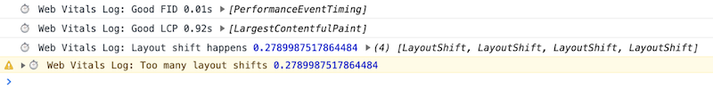
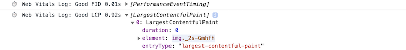

# `web-vitals.log` (alpha)
Wrapper of [GoogleChrome/web-vitals](https://github.com/GoogleChrome/web-vitals).

This script measures [Core Web Vitals](https://web.dev/vitals/) and outputs the result to console while you are using sites.

In Core Web Vitals, runtime values are important, so developers need to use sites in a natural way. They should scroll down to collect "cumulative" layout shifts, and sometimes should tap an element below the fold for FID.

The values can be displayed as warning when exceeding its thresholds.



You can also see the specific element name with the value. This can be helpful for developers to inspect the reason of the result.



## Usage
This script can load via JavaScript module. 

```html
<script type="module" src="https://unpkg.com/@herablog/web-vitals.log/web-vitals.log"></script>
```

**NOTE**: This script should not be used in production environment.
